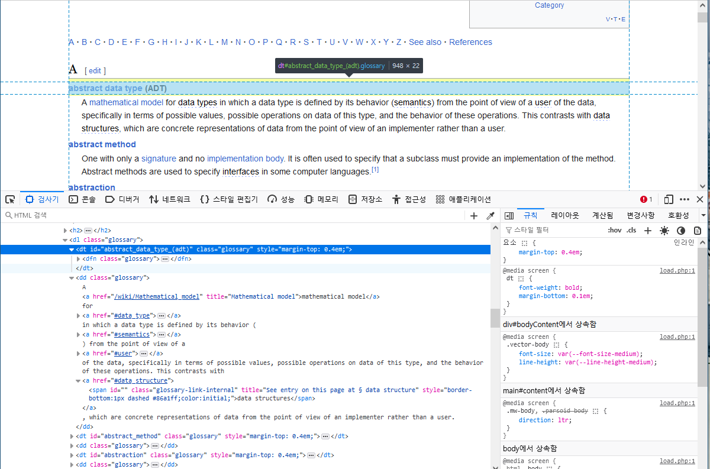

# DEVoca-scraper

## 실행 방법

```bash
source venv/bin/activate
pip install -r requirements.txt
```

## 스크래핑 방법

- 위키 백과의 [Glossary of computer science](https://en.wikipedia.org/wiki/Glossary_of_computer_science)에 나오는 단어와 설명 스크래핑.

- 해당 페이지는 각 알파벳('A', 'B', 'C'...) 별로 **단어 목록**이 `<dl class="glossary">` 태그로 감싸져있음.
- 단어 목록은 `<dt class="glossary">` 태그 안의 **단어**와 `<dd class="glossary">` 태그의 **단어 설명**으로 이루어짐.

    
