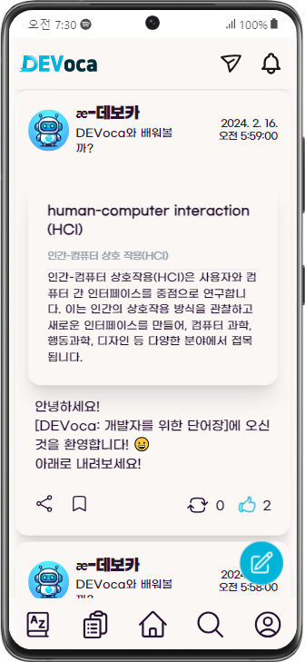
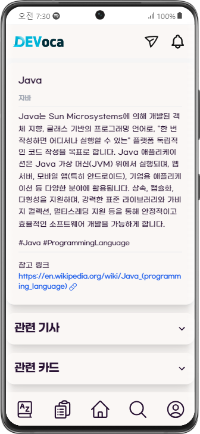

# DEVoca: 개발자를 위한 단어장

DEVoca는 개발 용어(이하 단어)와 설명을 피드에 올리고, 다른 사용자의 단어 설명을 통해 새로운 단어를 습득, 저장, 학습할 수 있는 서비스입니다.

- 삼성 청년 SW 아카데미 (SSAFY) 10기 공통 프로젝트 구미 1반 12팀
- 2024.01.03.-2024.02.16.
- https://defiant-piccolo-ad9.notion.site/DEVoca-43b00aab7a2545bdbead9917bf7e96ba

---

## 목차

<!-- TOC -->
* [DEVoca: 개발자를 위한 단어장](#devoca-개발자를-위한-단어장)
  * [목차](#목차)
  * [기술 스택](#기술-스택)
  * [실행 방법](#실행-방법)
  * [시스템 구조도](#시스템-구조도)
  * [팀원 소개](#팀원-소개)
  * [문서](#문서)
<!-- TOC -->

---

|  |  |  |
|:-------------------------------:|:-------------------------------:|:-------------------------------:|

## 기술 스택

|    |         Name          |     |        |       Name        |
|:--:|:---------------------:|:---:|:------:|:-----------------:|
| FE |         node          |     |   BE   |       Java        |
| FE |          Vue          |     |   BE   |    Spring Boot    |
| FE |      vue-router       |     |   BE   |       MySQL       |
| FE |         axios         |     |   BE   |       Redis       |
| FE | event-source-polyfill |     |   BE   |      Gradle       |
| FE |         pinia         |     |   BE   |     jjwt-api      |
| FE |        stompjs        |     |   OS   |      Ubuntu       |
| FE |        eslint         |     | Infra  |      Docker       |
| FE |       prettier        |     | Infra  |  Docker Compose   |
| FE |      tailwindcss      |     | DevOps |      Jenkins      |
| FE |         vite          |     |  IDE   |   IntelliJ IDEA   |
| FE |         Nginx         |     |  IDE   | VisualStudio Code |

## 실행 방법

- 개발 환경 실행은 [포팅 매뉴얼](exec/1.BuildAndDeploy.md) 참고.

## 시스템 구조도

## 팀원 소개

|  |  |  |  |  |  |
|:----------------------------------------------------------:|:-------------------------------------------------------:|:----------------------------------------------------:|:------------------------------------------------------:|:----------------------------------------------------:|:-------------------------------------------------------:|
|   [신주용 @cheesecat47](https://github.com/cheesecat47)    |     [김주이 @jjuyii49](https://github.com/jjuyii49)     |     [류지윤 @Ryujy](   https://github.com/Ryujy)     |     [배성연 @bae2019](https://github.com/bae2019)      |      [심규영 @qysim](https://github.com/qysim)       |   [오승현 @osh-lang](   https://github.com/osh-lang)    |

## 문서

- [기능 명세서](./docs/specifications.md)
- [화면 설계서](./docs/pages.md)
- [디자인 시스템](./docs/design-system.md)
- [ERD](./docs/ERD.md)
- [포팅 매뉴얼](exec/1.BuildAndDeploy.md)
- [외부 서비스 정보](exec/2.ExternalServices.md)
- [시연 시나리오](exec/4.DemoScenario.md)
