# DEVoca 시연 시나리오

> 시연 순서에 따른 site 화면별, 실행별(클릭 위치 등) 상세 설명

---

## Table of Contents

<!-- TOC -->
* [DEVoca 시연 시나리오](#devoca-시연-시나리오)
  * [Table of Contents](#table-of-contents)
  * [시나리오 1: CARD에 대한 설명](#시나리오-1-card에-대한-설명)
  * [시나리오 2: DEVoca의 주요 기능](#시나리오-2-devoca의-주요-기능)
  * [시나리오 3: DM, 알림 기능](#시나리오-3-dm-알림-기능)
<!-- TOC -->

---

## 시나리오 1: CARD에 대한 설명

DEVoca에서는 개발 용어, 해당 용어에 대한 유저의 의견, 다른 유저의 의견을 인용한 의견을 모두 '카드'로 표현함. 시나리오 1에서는 이 '카드'에 대해 설명.

|                                       순서                                       |                화면                |
|:------------------------------------------------------------------------------:|:--------------------------------:|
|                                     1. 로그인                                     |                                  |
|       2. 메인화면: 팔로우 중인 유저들이 작성한 카드가 표시됨. 최초 가입 시에는 DEVoca 봇 계정이 팔로우되어 있음.       |  |
|      3. 의견 카드 상세 화면: 선택한 단어 정보와 사용자가 작성한 의견, 추가적으로 제공 되는 정보 등을 확인할 수 있음.       | 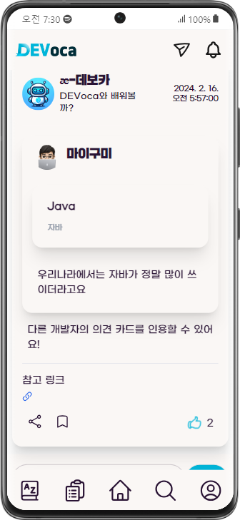 |
| 4. 단어 카드 상세 화면: 단어의 설명과 참고 자료 링크를 확인할 수 있음. 이 단어를 인용한 다른 유저들의 의견 카드를 모아볼 수 있음. |  |

## 시나리오 2: DEVoca의 주요 기능

DEVoca의 주요 기능 소개.

|                                           순서                                            |                                화면                                 |                                                                    |
|:---------------------------------------------------------------------------------------:|:-----------------------------------------------------------------:|:------------------------------------------------------------------:|
| 1. 단어 사전 페이지: 알파벳 첫 글자로 페이지를 구분하여 표시. 단어 목록과 간단한 설명을 볼 수 있고, 단어를 클릭하면 단어 카드 상세 화면으로 이동. |                                   |                                                                    |
|                               2. 홈 화면에서는 의견 카드를 작성할 수 있음.                               |                 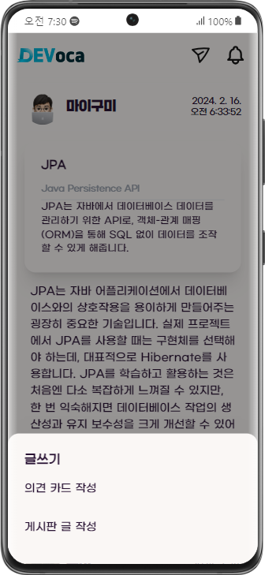                  |                                                                    |
|                    3. 의견 카드 작성 시에 단어를 인용할 수 있음. 단어 검색 창은 자동 완성이 지원됨.                    |                 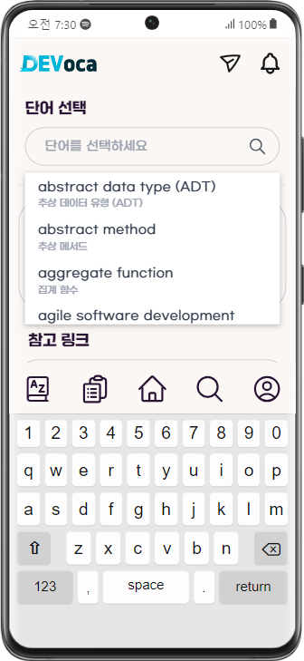                  |                  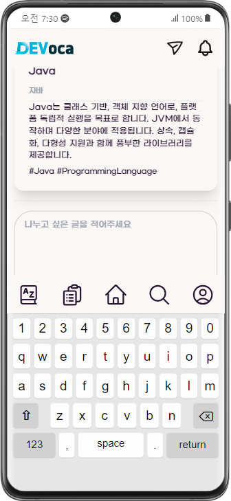                  |
|            4. 검색 화면에는 최근 검색어, 인기 검색어가 표시됨. 이 검색어를 누르거나 직접 입력하여 검색 결과 확인 가능.             |                 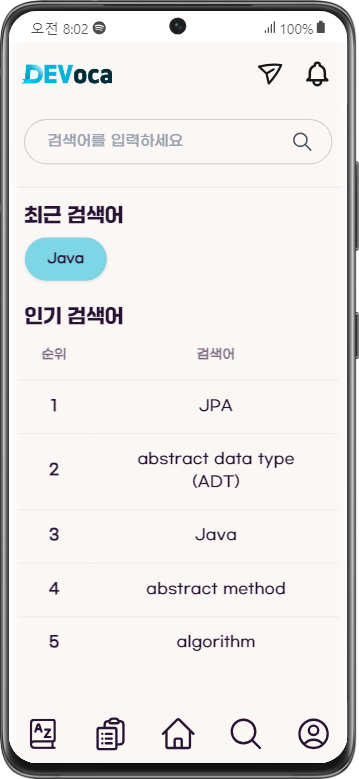                  |
|                       5. 마이페이지에서는 배지 목록, 참여한 퀴즈 목록, 단어장을 볼 수 있음.                        | 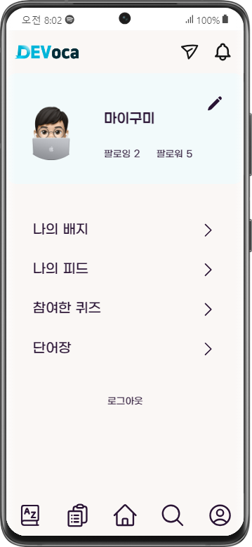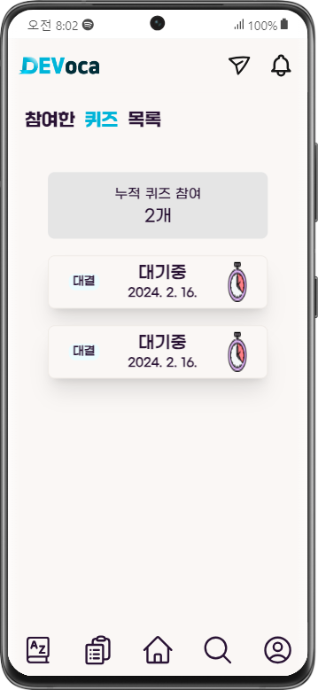 | 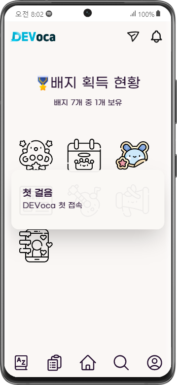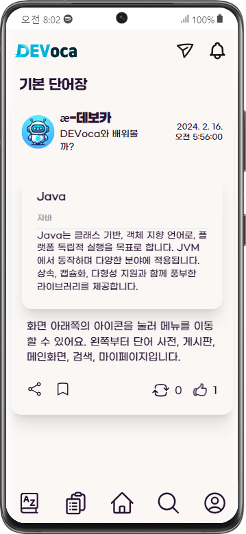 |
|           6. 실시간 DM 기능을 통해 다른 유저들과 소통할 수 있음. 또한, 도전장 신청 메시지도 DM 페이지에서 확인 가능.            |                 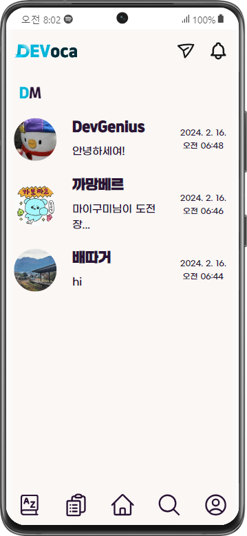                 |                 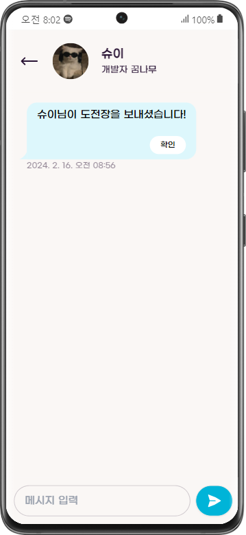                  |

## 시나리오 3: DM, 알림 기능

|                                           순서                                           |                                 화면                                 |                                   |
|:--------------------------------------------------------------------------------------:|:------------------------------------------------------------------:|:---------------------------------:|
|                             1. 친한 유저에게 단어 퀘즈 도전장을 보낼 수 있음.                             |                 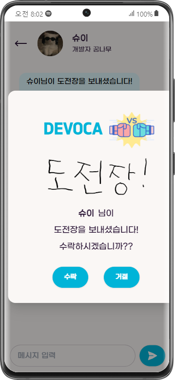                  |                                   |
|                                2. 퀴즈가 끝나고 서로 점수 비교 가능.                                 | 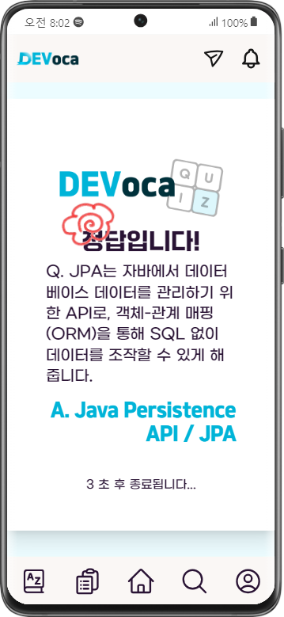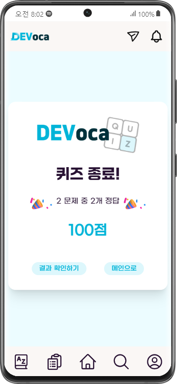 | 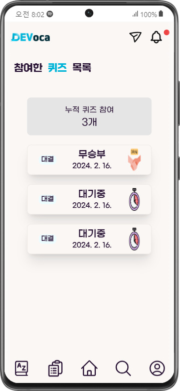 |
| 3. DM이 오거나 좋아요 등의 이벤트가 발생하면 알림이 옴. 알림은 알림 목록 페이지에서 볼 수 있고, 알림 목록에서 하나 클릭 시 해당 게시물로 이동. |                 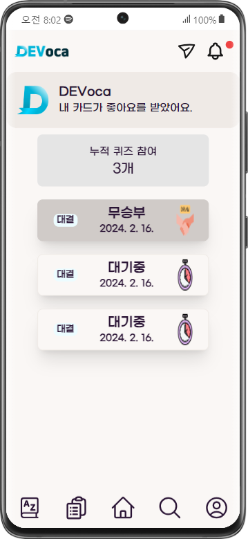                  | 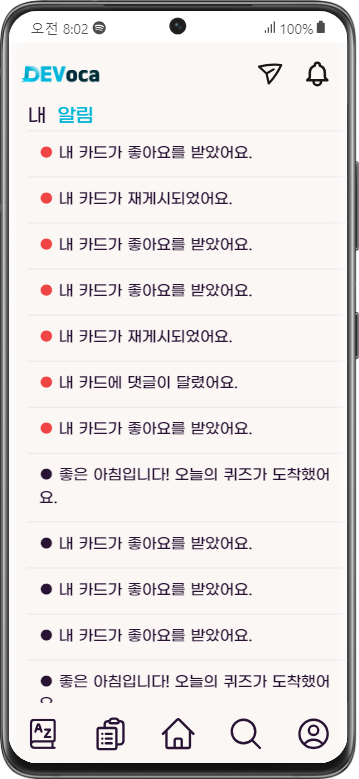 |
